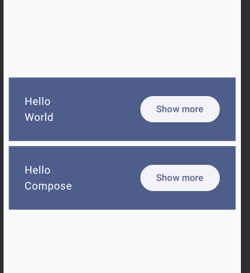

# 任务2：Jetpack Compose 基础组件实践

## 1. 实验目标

本次任务是实践 Jetpack Compose 组件用于 Android 应用的界面布局。通过本次任务，我学习到了：

- 使用 `@Composable` 注解定义可组合函数来构建 UI
- 通过 `Surface` 和 `MaterialTheme` 应用 Material Design 样式
- 组合 `Column` 和 `Row` 实现布局
- 使用 `remember` 和 `mutableStateOf` 管理 UI 状态
- 实现交互式内容展开/折叠效果

## 2. 创建项目

### 2.1 创建新项目
在 Android Studio 中创建一个名为 **BasicsCodelab** 的新项目，选择 Empty Activity 模板，语言选择 Kotlin，最小支持 SDK 选择 API 21。

### 2.2 项目结构

项目创建完成后的结构如下：

```
BasicsCodelab/
├── app/
│   ├── src/
│   │   ├── main/
│   │   │   ├── java/com/example/basicscodelab/
│   │   │   │   ├── MainActivity.kt          # 主活动文件
│   │   │   │   └── ui/theme/                # 主题相关文件
│   │   │   │       ├── Theme.kt
│   │   │   │       ├── Color.kt
│   │   │   │       └── Type.kt
│   │   │   ├── res/
│   │   │   └── AndroidManifest.xml
│   │   └── build.gradle.kts
├── build.gradle.kts
└── settings.gradle.kts
```

## 3. 核心代码实现

###  Greeting 可组合函数

```kotlin
@Composable
fun Greeting(name: String, modifier: Modifier = Modifier) {
    val expanded = remember { mutableStateOf(false) }
    val extraPadding = if (expanded.value) 48.dp else 0.dp

    Surface(
        color = MaterialTheme.colorScheme.primary,
        modifier = modifier.padding(vertical = 4.dp, horizontal = 8.dp)
    ) {
        Row(modifier = Modifier.padding(24.dp)) {
            Column(
                modifier = Modifier
                    .weight(1f)
                    .padding(bottom = extraPadding)
            ) {
                Text(text = "Hello ")
                Text(text = name)
            }
            ElevatedButton(
                onClick = { expanded.value = !expanded.value }
            ) {
                Text(if (expanded.value) "Show less" else "Show more")
            }
        }
    }
}
```

## 4. 核心知识点解析

### 4.1 @Composable 注解

`@Composable` 是 Compose 的核心注解，用于标记可组合函数。这些函数只能在其他 `@Composable` 函数或 `setContent` 中调用，每次状态变化时会被重新调用以更新 UI。

### 4.2 布局组件

- **Column**：垂直排列子元素
- **Row**：水平排列子元素

### 4.3 UI 状态管理（核心）

使用 `remember` 和 `mutableStateOf` 管理 UI 状态是本次实验的重点：

```kotlin
val expanded = remember { mutableStateOf(false) }
```

- `mutableStateOf(false)`：创建一个可观察的状态对象，初始值为 false
- `remember`：在重组之间保持状态值
- 当 `expanded.value` 改变时，Compose 会自动重新组合相关的 UI

### 4.4 交互功能实现

通过 `ElevatedButton` 实现展开/折叠交互：

```kotlin
ElevatedButton(
    onClick = { expanded.value = !expanded.value }
) {
    Text(if (expanded.value) "Show less" else "Show more")
}
```

## 5. 运行效果

应用启动后，显示两个 Greeting 卡片，点击 "Show more" 按钮可以展开卡片，点击 "Show less" 按钮可以折叠卡片。



## 6. 知识点总结

| 概念 | 说明 |
|------|------|
| `@Composable` | 标记函数为可组合函数 |
| `MaterialTheme` / `Surface` | Material Design 样式组件 |
| `Column` / `Row` | 布局组件 |
| `remember` + `mutableStateOf` | UI 状态管理核心 |
| `ElevatedButton` | Material 3 按钮组件 |

