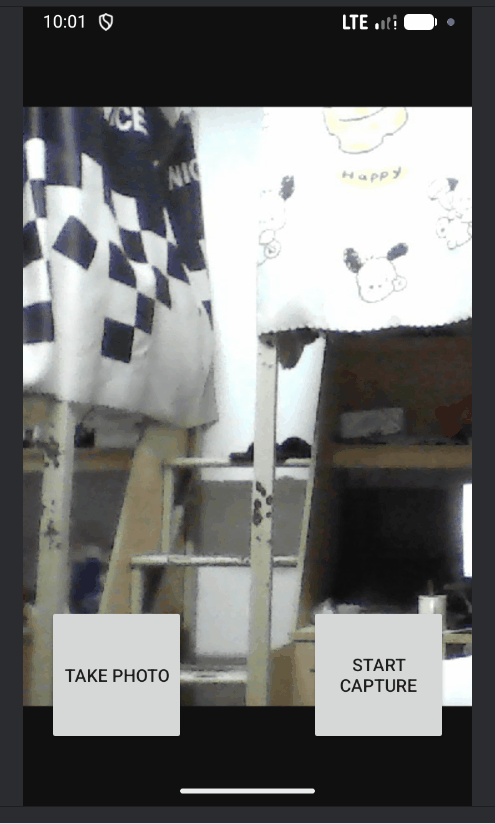
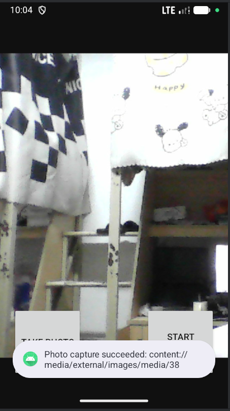
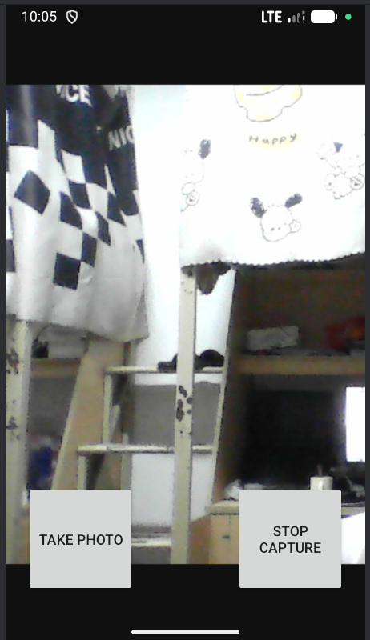
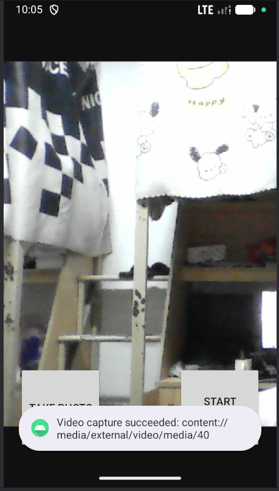
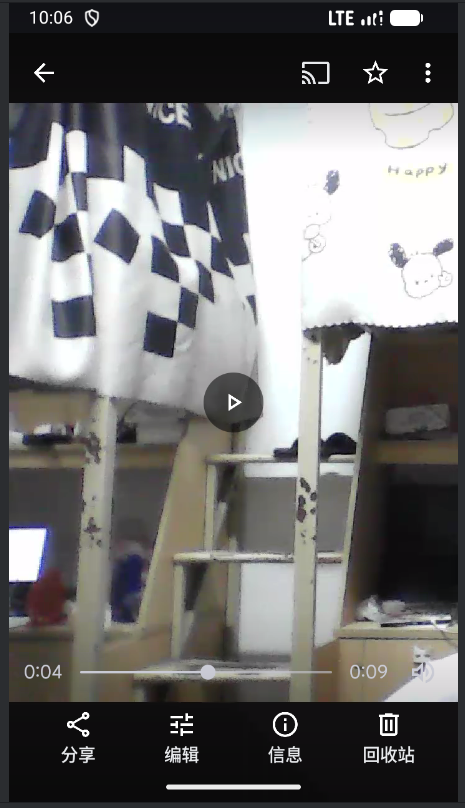
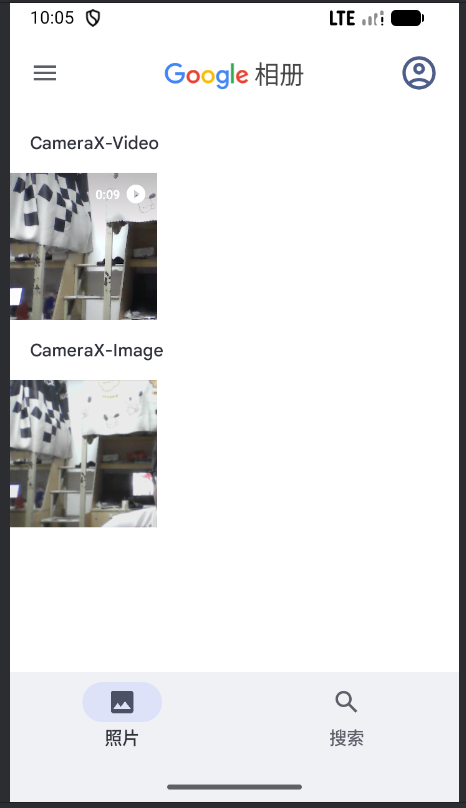

# Android CameraX 实验报告

## 一、实验目的

1. **掌握 Android CameraX 拍照功能的基本用法**：CameraX 是开发智能应用的必要组件，本次实验十分必要。
2. **掌握 Android CameraX 视频捕捉功能的基本用法**
3. **进一步熟悉 Kotlin 语言的特性**

## 二、实验内容

### 2.1 CameraX 简介

CameraX 是 Android 最新的支持开发相机应用的 Jetpack 库，支持最低 API level 21。本实验按照教程完成 CameraXApp 的构建。

### 2.2 核心功能

| 功能 | 说明 |
|------|------|
| **Preview（预览）** | 将摄像头画面实时显示到界面上 |
| **ImageCapture（拍照）** | 支持高质量静态图片捕捉 |
| **VideoCapture（录像）** | 用于录制视频 |


### 2.3 技术要点

- Android 布局的用法（ConstraintLayout）
- Android 硬件权限的获取（相机、录音、存储权限）
- CameraX 库的基本用法

## 三、项目结构

```
CameraXApp/
├── app/
│   ├── src/
│   │   └── main/
│   │       ├── java/com/android/example/cameraxapp/
│   │       │   └── MainActivity.kt          # 主活动，包含所有 CameraX 逻辑
│   │       ├── res/
│   │       │   ├── layout/
│   │       │   │   └── activity_main.xml    # 界面布局文件
│   │       │   ├── values/
│   │       │   │   ├── strings.xml          # 字符串资源
│   │       │   │   └── themes.xml           # 主题配置
│   │       │   └── AndroidManifest.xml      # 权限声明
│   └── build.gradle.kts                    # 依赖配置
├── gradle/
│   └── libs.versions.toml                  # 版本管理
└── build.gradle.kts                        # 项目配置
```

## 四、核心代码实现

### 4.1 依赖配置

在 `app/build.gradle.kts` 中添加 CameraX 依赖：

```kotlin
val camerax_version = "1.1.0-beta01"
implementation("androidx.camera:camera-core:${camerax_version}")
implementation("androidx.camera:camera-camera2:${camerax_version}")
implementation("androidx.camera:camera-lifecycle:${camerax_version}")
implementation("androidx.camera:camera-video:${camerax_version}")
implementation("androidx.camera:camera-view:${camerax_version}")
implementation("androidx.camera:camera-extensions:${camerax_version}")
```

### 4.2 权限声明

在 `AndroidManifest.xml` 中声明必要权限：

```xml
<uses-feature android:name="android.hardware.camera.any" />
<uses-permission android:name="android.permission.CAMERA" />
<uses-permission android:name="android.permission.RECORD_AUDIO" />
<uses-permission android:name="android.permission.WRITE_EXTERNAL_STORAGE" 
    android:maxSdkVersion="28" />
```

### 4.3 布局设计

`activity_main.xml` 使用 ConstraintLayout 布局：

- `PreviewView`：全屏显示相机预览
- `image_capture_button`：拍照按钮（左侧）
- `video_capture_button`：录像按钮（右侧）

### 4.4 核心功能实现

#### 4.4.1 权限检查

```kotlin
private fun allPermissionsGranted() = REQUIRED_PERMISSIONS.all {
    ContextCompat.checkSelfPermission(baseContext, it) == PackageManager.PERMISSION_GRANTED
}
```

#### 4.4.2 启动相机

```kotlin
private fun startCamera() {
    val cameraProviderFuture = ProcessCameraProvider.getInstance(this)
    cameraProviderFuture.addListener({
        val cameraProvider = cameraProviderFuture.get()
        
        // 预览配置
        val preview = Preview.Builder().build()
            .also { it.setSurfaceProvider(viewBinding.viewFinder.surfaceProvider) }
        
        // 拍照配置
        imageCapture = ImageCapture.Builder().build()
        
        // 录像配置
        val recorder = Recorder.Builder()
            .setQualitySelector(QualitySelector.from(
                Quality.HIGHEST,
                FallbackStrategy.higherQualityOrLowerThan(Quality.SD)))
            .build()
        videoCapture = VideoCapture.withOutput(recorder)
        
        // 绑定生命周期
        cameraProvider.bindToLifecycle(
            this, CameraSelector.DEFAULT_BACK_CAMERA, 
            preview, imageCapture, videoCapture)
    }, ContextCompat.getMainExecutor(this))
}
```

#### 4.4.3 拍照功能

```kotlin
private fun takePhoto() {
    val imageCapture = imageCapture ?: return
    
    // 创建带时间戳的文件名
    val name = SimpleDateFormat(FILENAME_FORMAT, Locale.US).format(System.currentTimeMillis())
    val contentValues = ContentValues().apply {
        put(MediaStore.MediaColumns.DISPLAY_NAME, name)
        put(MediaStore.MediaColumns.MIME_TYPE, "image/jpeg")
        if (Build.VERSION.SDK_INT > Build.VERSION_CODES.P) {
            put(MediaStore.Images.Media.RELATIVE_PATH, "Pictures/CameraX-Image")
        }
    }
    
    // 保存照片到相册
    imageCapture.takePicture(
        ImageCapture.OutputFileOptions.Builder(
            contentResolver,
            MediaStore.Images.Media.EXTERNAL_CONTENT_URI,
            contentValues
        ).build(),
        ContextCompat.getMainExecutor(this),
        object : ImageCapture.OnImageSavedCallback {
            override fun onImageSaved(output: ImageCapture.OutputFileResults) {
                Toast.makeText(baseContext, "Photo capture succeeded", Toast.LENGTH_SHORT).show()
            }
            override fun onError(exc: ImageCaptureException) {
                Log.e(TAG, "Photo capture failed: ${exc.message}", exc)
            }
        }
    )
}
```

#### 4.4.4 录像功能

```kotlin
private fun captureVideo() {
    val videoCapture = this.videoCapture ?: return
    
    // 如果正在录制，则停止
    val curRecording = recording
    if (curRecording != null) {
        curRecording.stop()
        recording = null
        return
    }
    
    // 创建录像输出配置
    val name = SimpleDateFormat(FILENAME_FORMAT, Locale.US).format(System.currentTimeMillis())
    val contentValues = ContentValues().apply {
        put(MediaStore.MediaColumns.DISPLAY_NAME, name)
        put(MediaStore.MediaColumns.MIME_TYPE, "video/mp4")
        if (Build.VERSION.SDK_INT > Build.VERSION_CODES.P) {
            put(MediaStore.Video.Media.RELATIVE_PATH, "Movies/CameraX-Video")
        }
    }
    
    // 开始录制
    recording = videoCapture.output
        .prepareRecording(this, MediaStoreOutputOptions.Builder(
            contentResolver, MediaStore.Video.Media.EXTERNAL_CONTENT_URI
        ).setContentValues(contentValues).build())
        .apply {
            if (PermissionChecker.checkSelfPermission(this@MainActivity,
                    Manifest.permission.RECORD_AUDIO) == PermissionChecker.PERMISSION_GRANTED) {
                withAudioEnabled()
            }
        }
        .start(ContextCompat.getMainExecutor(this)) { recordEvent ->
            when (recordEvent) {
                is VideoRecordEvent.Start -> {
                    viewBinding.videoCaptureButton.text = getString(R.string.stop_capture)
                }
                is VideoRecordEvent.Finalize -> {
                    viewBinding.videoCaptureButton.text = getString(R.string.start_capture)
                    if (!recordEvent.hasError()) {
                        Toast.makeText(baseContext, "Video capture succeeded", Toast.LENGTH_SHORT).show()
                    }
                }
            }
        }
}
```

## 五、功能展示

### 5.1 应用界面



### 5.2 拍照功能

点击左侧 "Take Photo" 按钮，照片自动保存到系统相册的 `Pictures/CameraX-Image` 目录。


### 5.3 录像功能

点击右侧 "Start Capture" 按钮开始录制视频，按钮文字变为 "Stop Capture"，再次点击停止录制，视频保存到 `Movies/CameraX-Video` 目录。




### 5.4 存储结果

相册中可以查看到保存的照片和视频。


## 六、实验总结

通过本次实验，我掌握了：

1. **CameraX 库的基本用法**：包括 Preview、ImageCapture、VideoCapture 三个核心用例的实现
2. **Android 权限管理**：动态请求相机、录音等敏感权限的方法
3. **Kotlin 语言特性**：Lambda 表达式、高阶函数、空安全等特性的实际应用
4. **Android 布局设计**：使用 ConstraintLayout 实现响应式界面布局

## 七、注意事项

1. 在模拟器中测试时，需要在 AVD 配置中选择 PC 摄像头作为模拟相机
2. 确保设备授予了相机和录音权限
3. Android 10 及以上版本使用 MediaStore API 保存文件，无需 WRITE_EXTERNAL_STORAGE 权限
