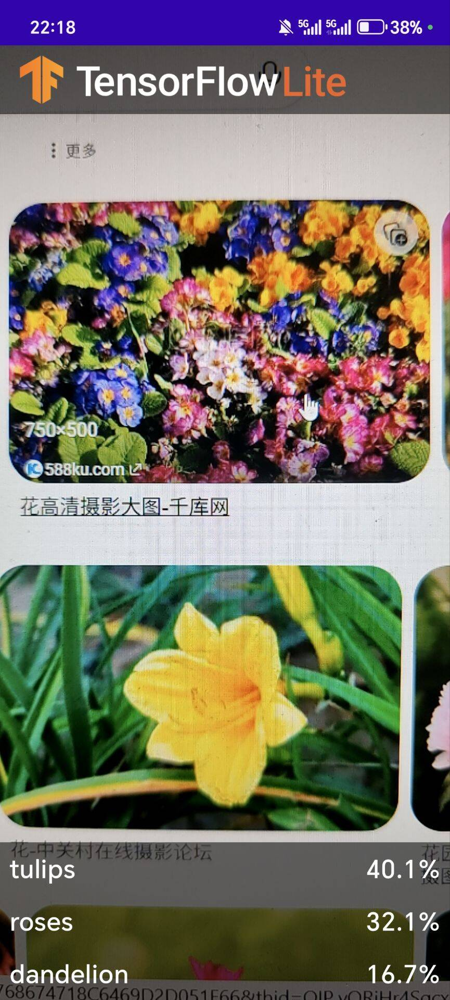
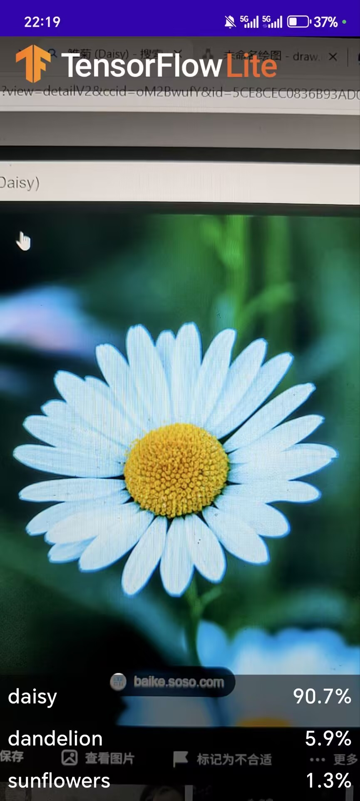
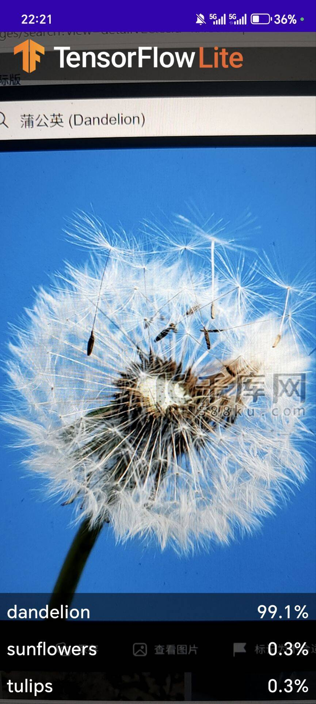
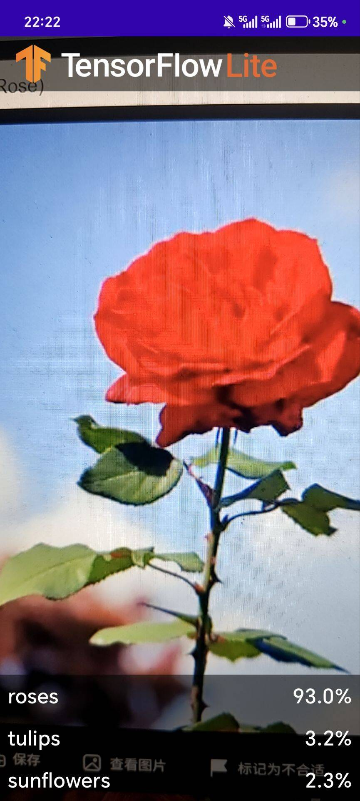
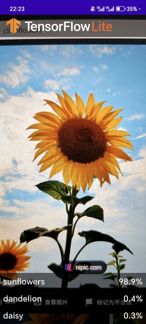
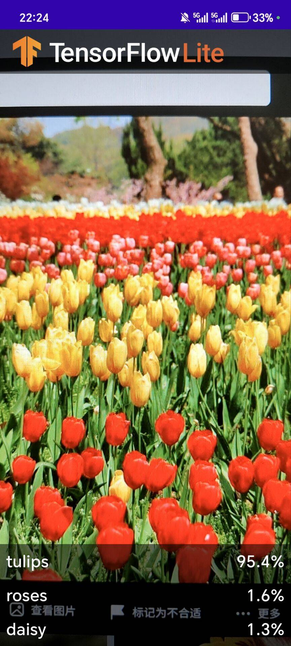

# 智能图像分类APP实验报告

---

## 一、实验目的

1. **掌握TensorFlow Lite在Android平台的应用**：学习如何在Android应用中集成和使用TensorFlow Lite机器学习模型。
2. **理解CameraX库的使用**：掌握AndroidX Camera库进行相机预览、图像分析等功能的实现。
3. **学习MVVM架构模式**：理解数据视图模型（ViewModel）的设计思想和使用方法。
4. **掌握图像分类应用的完整开发流程**：从模型导入、图像预处理、模型推理到结果展示的端到端实现。

---

## 二、实验内容

### 实验概述

本实验基于TensorFlow Lite构建一个Android花卉识别应用，主要功能包括：

- 使用CameraX实时获取相机图像
- 对获取的图像进行预处理（YUV到RGB转换）
- 使用预训练的花卉分类模型进行推理
- 展示识别结果（Top 3预测类别及置信度）

---

## 三、项目结构

```
TFLClassify/                              # 项目根目录
├── finish/                               # 完成版模块（参考实现）
│   ├── src/main/java/org/tensorflow/lite/examples/classification/
│   │   ├── MainActivity.kt               # 主活动（已完成）
│   │   ├── ui/
│   │   │   └── RecognitionAdapter.kt     # 结果列表适配器
│   │   ├── util/
│   │   │   └── YuvToRgbConverter.kt     # YUV转RGB工具类
│   │   └── viewmodel/
│   │       ├── Recognition.kt            # 识别结果数据类
│   │       └── RecognitionListViewModel.kt # 识别列表视图模型
│   ├── src/main/ml/
│   │   └── FlowerModel.tflite            # TensorFlow Lite模型
│   └── build.gradle                      # 模块构建配置
├── start/                                # 起始版模块（待完成）
│   └── src/main/                         # 结构同finish模块
├── gradle/wrapper/                       # Gradle包装器
├── build.gradle                          # 项目构建配置
├── settings.gradle                       # 项目设置
└── gradle.properties                     # Gradle属性配置
```

**核心文件说明**：

| 文件 | 功能说明 |
|------|----------|
| `MainActivity.kt` | 主活动，负责相机初始化、图像分析和结果展示 |
| `YuvToRgbConverter.kt` | 将CameraX输出的YUV格式图像转换为RGB格式的Bitmap |
| `Recognition.kt` | 识别结果数据类，包含标签和置信度 |
| `RecognitionListViewModel.kt` | ViewModel，管理识别结果列表的生命周期 |
| `RecognitionAdapter.kt` | RecyclerView适配器，展示识别结果列表 |
| `FlowerModel.tflite` | 预训练的花卉分类模型 |

---

## 四、实验步骤

### 4.1 环境准备

1. **安装Android Studio**：下载并安装Android Studio 2023.2.1或更高版本。

2. **克隆项目**：
```bash
git clone <项目仓库地址>
cd TFLClassify
```

3. **同步项目**：打开Android Studio，导入项目后等待Gradle同步完成。

### 4.2 完成TODO代码项

项目中`start`模块的`MainActivity.kt`包含以下TODO待完成项：

| TODO编号 | 位置 | 功能描述 |
|----------|------|----------|
| TODO 1 | 第209行 | 添加TensorFlow Lite模型类变量 |
| TODO 2 | 第226行 | 将Image转换为Bitmap再转换为TensorImage |
| TODO 3 | 第226行 | 使用训练模型处理图像，排序并提取Top结果 |
| TODO 4 | 第226行 | 将概率结果转换为Recognition列表 |
| TODO 6 | 第213行 | 可选GPU加速配置 |

### 4.3 导入TensorFlow Lite模型

模型文件位于`finish/src/main/ml/FlowerModel.tflite`，需要复制到`start/src/main/ml/`目录下。

### 4.4 配置buildFeatures

在`start/build.gradle`中确保启用以下配置：

```gradle
android {
    buildFeatures {
        dataBinding = true
        mlModelBinding = true
        buildConfig = true
    }
}
```

### 4.5 运行应用

1. 连接Android真机设备
2. 选择`start`模块作为运行目标
3. 点击运行按钮，等待应用安装启动

---

## 五、核心代码

### 5.1 图像分析器实现

```kotlin
private class ImageAnalyzer(ctx: Context, private val listener: RecognitionListener) :
    ImageAnalysis.Analyzer {

    // 懒加载TensorFlow Lite模型
    private val flowerModel: FlowerModel by lazy {
        // GPU兼容性检测
        val compatList = CompatibilityList()

        val options = if (compatList.isDelegateSupportedOnThisDevice) {
            Log.d(TAG, "This device is GPU Compatible ")
            Model.Options.Builder().setDevice(Model.Device.GPU).build()
        } else {
            Log.d(TAG, "This device is GPU Incompatible ")
            Model.Options.Builder().setNumThreads(4).build()
        }

        FlowerModel.newInstance(ctx, options)
    }

    override fun analyze(imageProxy: ImageProxy) {
        val items = mutableListOf<Recognition>()

        // 转换Image为Bitmap再转换为TensorImage
        val tfImage = TensorImage.fromBitmap(toBitmap(imageProxy))

        // 处理图像并获取Top 3结果
        val outputs = flowerModel.process(tfImage)
            .probabilityAsCategoryList.apply {
                sortByDescending { it.score }
            }.take(MAX_RESULT_DISPLAY)

        // 转换为Recognition列表
        for (output in outputs) {
            items.add(Recognition(output.label, output.score))
        }

        listener(items.toList())
        imageProxy.close()
    }
}
```

### 5.2 YUV转RGB转换

```kotlin
@SuppressLint("UnsafeExperimentalUsageError")
private fun toBitmap(imageProxy: ImageProxy): Bitmap? {
    val image = imageProxy.image ?: return null

    if (!::bitmapBuffer.isInitialized) {
        rotationMatrix = Matrix()
        rotationMatrix.postRotate(imageProxy.imageInfo.rotationDegrees.toFloat())
        bitmapBuffer = Bitmap.createBitmap(
            imageProxy.width, imageProxy.height, Bitmap.Config.ARGB_8888
        )
    }

    yuvToRgbConverter.yuvToRgb(image, bitmapBuffer)

    return Bitmap.createBitmap(
        bitmapBuffer, 0, 0, bitmapBuffer.width, bitmapBuffer.height, rotationMatrix, false
    )
}
```

### 5.3 ViewModel数据更新

```kotlin
class RecognitionListViewModel : ViewModel() {
    private val _recognitionList = MutableLiveData<List<Recognition>>()
    val recognitionList: LiveData<List<Recognition>> = _recognitionList

    fun updateData(newList: List<Recognition>) {
        _recognitionList.postValue(newList)
    }
}
```

### 5.4 CameraX配置

```kotlin
private fun startCamera() {
    val cameraProviderFuture = ProcessCameraProvider.getInstance(this)

    cameraProviderFuture.addListener(Runnable {
        val cameraProvider = cameraProviderFuture.get()

        preview = Preview.Builder().build()

        imageAnalyzer = ImageAnalysis.Builder()
            .setTargetResolution(Size(224, 224))
            .setBackpressureStrategy(ImageAnalysis.STRATEGY_KEEP_ONLY_LATEST)
            .build()
            .also {
                it.setAnalyzer(cameraExecutor, ImageAnalyzer(this) { items ->
                    recogViewModel.updateData(items)
                })
            }

        val cameraSelector = if (cameraProvider.hasCamera(CameraSelector.DEFAULT_BACK_CAMERA))
            CameraSelector.DEFAULT_BACK_CAMERA else CameraSelector.DEFAULT_FRONT_CAMERA

        cameraProvider.unbindAll()
        camera = cameraProvider.bindToLifecycle(this, cameraSelector, preview, imageAnalyzer)
        preview.setSurfaceProvider(viewFinder.surfaceProvider)
    }, ContextCompat.getMainExecutor(this))
}
```

---

## 六、功能展示

### 6.1 应用界面

| 界面元素 | 描述 |
|----------|------|
| 相机预览 | 全屏显示相机实时画面 |
| 结果列表 | 底部展示Top 3识别结果 |
| 标签显示 | 显示花卉类别名称 |
| 置信度显示 | 显示预测概率百分比 |

界面图片占位符

### 6.2 功能演示

#### 6.2.1 应用界面总览


#### 6.2.2 识别结果展示

##### 雏菊 (Daisy)


##### 蒲公英 (Dandelion)


##### 玫瑰 (Rose)


##### 向日葵 (Sunflower)


##### 郁金香 (Tulip)


### 6.3 支持的花卉类别

模型支持以下5种花卉分类：
- 雏菊 (Daisy)
- 蒲公英 (Dandelion)
- 玫瑰 (Rose)
- 向日葵 (Sunflower)
- 郁金香 (Tulip)

---

## 七、实验总结

### 7.1 实验成果

1. **成功构建花卉识别应用**：完成了基于TensorFlow Lite的Android花卉识别应用开发。

2. **实现实时图像分类**：使用CameraX实时获取图像并进行分类，响应速度快。

3. **GPU加速优化**：实现了GPU兼容性检测，支持GPU加速推理。

4. **MVVM架构实践**：使用ViewModel管理识别结果，确保数据在屏幕旋转时不丢失。

### 7.2 技术难点

1. **YUV到RGB转换**：CameraX输出的是YUV格式图像，需要正确转换为RGB格式才能输入模型。

2. **图像旋转处理**：需要根据设备方向正确旋转图像。

3. **异步处理**：模型推理需要在后台线程执行，避免阻塞UI线程。

4. **GPU兼容性**：不同设备对GPU加速的支持程度不同，需要做好兼容性处理。

### 7.3 学习收获

1. 理解了TensorFlow Lite模型在移动端的部署流程。
2. 掌握了CameraX库的基本使用方法。
3. 学习了MVVM架构模式在Android开发中的应用。
4. 了解了图像预处理和模型推理的基本流程。

### 7.4 改进方向

1. **模型优化**：可以尝试量化模型以减小体积、提高速度。
2. **多模型支持**：支持切换不同的分类模型。
3. **离线识别**：完善离线识别功能，无需网络连接。
4. **用户体验优化**：添加更多交互功能和动画效果。


